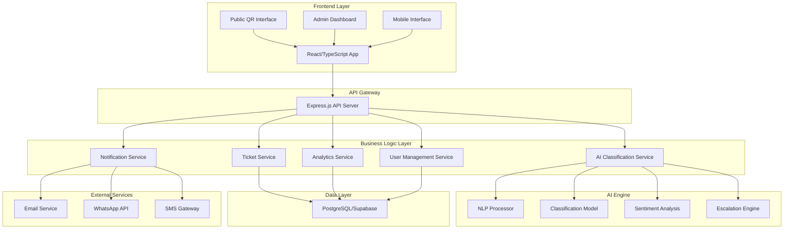

# Design Document

## Overview

The AI-Powered Complaint Management System extends the existing JEMPOL innovation platform to provide comprehensive public service management. The system integrates seamlessly with the current database structure while adding enterprise-grade complaint handling, AI-driven classification, and real-time analytics.

The architecture follows a microservices approach with clear separation between the existing innovation showcase functionality and the new complaint management features, ensuring scalability and maintainability.

## Architecture

### System Architecture



### Integration with Existing System

The complaint management system extends the current JEMPOL platform by:
- Reusing the existing `admins` table for authentication
- Maintaining the current innovation showcase functionality
- Adding new complaint-specific tables and services
- Preserving existing API endpoints and frontend components

## Components and Interfaces

### Core Components

#### 1. Ticket Management Service
- **Purpose**: Handle ticket lifecycle from creation to resolution
- **Key Methods**:
  - `createTicket(ticketData, isPublic)`: Create new tickets
  - `assignTicket(ticketId, assigneeId)`: Assign tickets to staff
  - `updateTicketStatus(ticketId, status)`: Update ticket status
  - `escalateTicket(ticketId, reason)`: Manual/automatic escalation

#### 2. AI Classification Service
- **Purpose**: Intelligent ticket processing and routing
- **Key Methods**:
  - `classifyTicket(content)`: Determine ticket type and urgency
  - `analyzeSentiment(text)`: Sentiment analysis for priority
  - `suggestAssignment(ticketData)`: Recommend assignment
  - `detectDuplicates(ticketContent)`: Identify similar tickets

#### 3. QR Code Service
- **Purpose**: Generate and manage unit-specific QR codes
- **Key Methods**:
  - `generateQRCode(unitId)`: Create QR codes for units
  - `validateQRAccess(qrToken)`: Validate QR code access
  - `trackQRUsage(qrId, metadata)`: Track QR code usage

#### 4. Notification Service
- **Purpose**: Multi-channel notification delivery
- **Key Methods**:
  - `sendNotification(userId, message, channels)`: Send notifications
  - `scheduleReminder(ticketId, deadline)`: Schedule SLA reminders
  - `broadcastAlert(message, roles)`: Send system-wide alerts

#### 5. Analytics Service
- **Purpose**: Real-time analytics and reporting
- **Key Methods**:
  - `getDashboardMetrics(filters)`: Real-time dashboard data
  - `generateReport(type, period, format)`: Generate reports
  - `getKPIData(role, timeframe)`: Role-specific KPIs

### API Interface Design

#### Public API Endpoints
```typescript
// Public ticket submission (no auth required)
POST /api/public/tickets
GET /api/public/tickets/:trackingNumber
POST /api/public/surveys/:ticketId

// QR Code access
GET /api/public/qr/:qrToken
POST /api/public/qr/:qrToken/tickets
```

#### Internal API Endpoints
```typescript
// Authenticated ticket management
GET /api/tickets
POST /api/tickets
PUT /api/tickets/:id
DELETE /api/tickets/:id
POST /api/tickets/:id/escalate
POST /api/tickets/:id/respond

// Dashboard and analytics
GET /api/dashboard/metrics
GET /api/analytics/reports
GET /api/analytics/kpi

// Administration
GET /api/admin/units
POST /api/admin/units
GET /api/admin/users
POST /api/admin/users
```

## Data Models

### Extended Database Schema

Building upon the existing tables (`admins`, `innovations`, `visitors`, `game_scores`), we add:

#### Core Complaint Management Tables

```sql
-- Units/Departments
CREATE TABLE units (
    id UUID PRIMARY KEY DEFAULT gen_random_uuid(),
    name VARCHAR(255) NOT NULL,
    code VARCHAR(50) UNIQUE NOT NULL,
    parent_unit_id UUID REFERENCES units(id),
    description TEXT,
    contact_email VARCHAR(255),
    contact_phone VARCHAR(50),
    sla_hours INTEGER DEFAULT 24,
    is_active BOOLEAN DEFAULT true,
    created_at TIMESTAMPTZ DEFAULT now(),
    updated_at TIMESTAMPTZ DEFAULT now()
);

-- Service Categories
CREATE TABLE service_categories (
    id UUID PRIMARY KEY DEFAULT gen_random_uuid(),
    name VARCHAR(255) NOT NULL,
    code VARCHAR(50) UNIQUE NOT NULL,
    description TEXT,
    default_sla_hours INTEGER DEFAULT 24,
    requires_attachment BOOLEAN DEFAULT false,
    is_active BOOLEAN DEFAULT true,
    created_at TIMESTAMPTZ DEFAULT now(),
    updated_at TIMESTAMPTZ DEFAULT now()
);

-- Extended Users (builds on existing admins table)
CREATE TABLE users (
    id UUID PRIMARY KEY DEFAULT gen_random_uuid(),
    admin_id UUID REFERENCES admins(id), -- Link to existing admin system
    employee_id VARCHAR(50),
    full_name VARCHAR(255) NOT NULL,
    email VARCHAR(255) UNIQUE NOT NULL,
    phone VARCHAR(50),
    unit_id UUID REFERENCES units(id),
    role VARCHAR(50) NOT NULL CHECK (role IN ('staff', 'supervisor', 'manager', 'director', 'admin')),
    is_active BOOLEAN DEFAULT true,
    created_at TIMESTAMPTZ DEFAULT now(),
    updated_at TIMESTAMPTZ DEFAULT now()
);

-- Tickets
CREATE TABLE tickets (
    id UUID PRIMARY KEY DEFAULT gen_random_uuid(),
    ticket_number VARCHAR(50) UNIQUE NOT NULL,
    type VARCHAR(50) NOT NULL CHECK (type IN ('information', 'complaint', 'suggestion', 'satisfaction')),
    category_id UUID REFERENCES service_categories(id),
    title VARCHAR(500) NOT NULL,
    description TEXT NOT NULL,
    
    -- Submitter information (for public tickets)
    submitter_name VARCHAR(255),
    submitter_email VARCHAR(255),
    submitter_phone VARCHAR(50),
    submitter_address TEXT,
    is_anonymous BOOLEAN DEFAULT false,
    
    -- Assignment and routing
    unit_id UUID REFERENCES units(id) NOT NULL,
    assigned_to UUID REFERENCES users(id),
    created_by UUID REFERENCES users(id), -- For internal tickets
    
    -- Status and priority
    status VARCHAR(50) DEFAULT 'open' CHECK (status IN ('open', 'in_progress', 'escalated', 'resolved', 'closed')),
    priority VARCHAR(50) DEFAULT 'medium' CHECK (priority IN ('low', 'medium', 'high', 'critical')),
    urgency_level INTEGER DEFAULT 3 CHECK (urgency_level BETWEEN 1 AND 5),
    
    -- AI Analysis
    ai_classification JSONB,
    sentiment_score DECIMAL(3,2),
    confidence_score DECIMAL(3,2),
    
    -- SLA Management
    sla_deadline TIMESTAMPTZ,
    first_response_at TIMESTAMPTZ,
    resolved_at TIMESTAMPTZ,
    
    -- Tracking
    source VARCHAR(50) DEFAULT 'web' CHECK (source IN ('web', 'qr_code', 'mobile', 'email', 'phone')),
    qr_code_id UUID REFERENCES qr_codes(id),
    ip_address INET,
    user_agent TEXT,
    
    created_at TIMESTAMPTZ DEFAULT now(),
    updated_at TIMESTAMPTZ DEFAULT now()
);

-- QR Codes for Units
CREATE TABLE qr_codes (
    id UUID PRIMARY KEY DEFAULT gen_random_uuid(),
    unit_id UUID REFERENCES units(id) NOT NULL,
    code VARCHAR(255) UNIQUE NOT NULL,
    token VARCHAR(500) UNIQUE NOT NULL,
    name VARCHAR(255) NOT NULL,
    description TEXT,
    is_active BOOLEAN DEFAULT true,
    usage_count INTEGER DEFAULT 0,
    created_at TIMESTAMPTZ DEFAULT now(),
    updated_at TIMESTAMPTZ DEFAULT now()
);

-- Ticket Responses
CREATE TABLE ticket_responses (
    id UUID PRIMARY KEY DEFAULT gen_random_uuid(),
    ticket_id UUID REFERENCES tickets(id) NOT NULL,
    responder_id UUID REFERENCES users(id) NOT NULL,
    message TEXT NOT NULL,
    is_internal BOOLEAN DEFAULT false,
    response_type VARCHAR(50) DEFAULT 'comment' CHECK (response_type IN ('comment', 'status_update', 'resolution', 'escalation')),
    created_at TIMESTAMPTZ DEFAULT now(),
    updated_at TIMESTAMPTZ DEFAULT now()
);

-- Ticket Escalations
CREATE TABLE ticket_escalations (
    id UUID PRIMARY KEY DEFAULT gen_random_uuid(),
    ticket_id UUID REFERENCES tickets(id) NOT NULL,
    from_user_id UUID REFERENCES users(id),
    to_user_id UUID REFERENCES users(id),
    from_role VARCHAR(50) NOT NULL,
    to_role VARCHAR(50) NOT NULL,
    reason TEXT NOT NULL,
    escalation_type VARCHAR(50) DEFAULT 'manual' CHECK (escalation_type IN ('manual', 'automatic', 'sla_breach')),
    escalated_at TIMESTAMPTZ DEFAULT now(),
    created_at TIMESTAMPTZ DEFAULT now()
);

-- Satisfaction Surveys
CREATE TABLE satisfaction_surveys (
    id UUID PRIMARY KEY DEFAULT gen_random_uuid(),
    ticket_id UUID REFERENCES tickets(id) NOT NULL,
    overall_score INTEGER CHECK (overall_score BETWEEN 1 AND 5),
    response_time_score INTEGER CHECK (response_time_score BETWEEN 1 AND 5),
    solution_quality_score INTEGER CHECK (solution_quality_score BETWEEN 1 AND 5),
    staff_courtesy_score INTEGER CHECK (staff_courtesy_score BETWEEN 1 AND 5),
    comments TEXT,
    submitted_at TIMESTAMPTZ DEFAULT now(),
    created_at TIMESTAMPTZ DEFAULT now()
);

-- Notifications
CREATE TABLE notifications (
    id UUID PRIMARY KEY DEFAULT gen_random_uuid(),
    user_id UUID REFERENCES users(id),
    ticket_id UUID REFERENCES tickets(id),
    type VARCHAR(50) NOT NULL CHECK (type IN ('ticket_created', 'ticket_assigned', 'ticket_escalated', 'ticket_resolved', 'sla_reminder', 'survey_request')),
    title VARCHAR(255) NOT NULL,
    message TEXT NOT NULL,
    channels JSONB DEFAULT '["web"]', -- ["web", "email", "whatsapp", "sms"]
    is_read BOOLEAN DEFAULT false,
    sent_at TIMESTAMPTZ,
    created_at TIMESTAMPTZ DEFAULT now()
);

-- AI Processing Logs
CREATE TABLE ai_logs (
    id UUID PRIMARY KEY DEFAULT gen_random_uuid(),
    ticket_id UUID REFERENCES tickets(id) NOT NULL,
    operation VARCHAR(100) NOT NULL,
    input_data JSONB,
    output_data JSONB,
    confidence_score DECIMAL(3,2),
    processing_time_ms INTEGER,
    model_version VARCHAR(50),
    created_at TIMESTAMPTZ DEFAULT now()
);

-- File Attachments
CREATE TABLE ticket_attachments (
    id UUID PRIMARY KEY DEFAULT gen_random_uuid(),
    ticket_id UUID REFERENCES tickets(id) NOT NULL,
    file_name VARCHAR(255) NOT NULL,
    file_path TEXT NOT NULL,
    file_size BIGINT NOT NULL,
    mime_type VARCHAR(100) NOT NULL,
    uploaded_by UUID REFERENCES users(id),
    created_at TIMESTAMPTZ DEFAULT now()
);
```

### Indexes for Performance

```sql
-- Ticket indexes
CREATE INDEX idx_tickets_status ON tickets(status);
CREATE INDEX idx_tickets_unit_id ON tickets(unit_id);
CREATE INDEX idx_tickets_assigned_to ON tickets(assigned_to);
CREATE INDEX idx_tickets_created_at ON tickets(created_at);
CREATE INDEX idx_tickets_sla_deadline ON tickets(sla_deadline);
CREATE INDEX idx_tickets_ticket_number ON tickets(ticket_number);

-- Performance indexes
CREATE INDEX idx_ticket_responses_ticket_id ON ticket_responses(ticket_id);
CREATE INDEX idx_notifications_user_id ON notifications(user_id);
CREATE INDEX idx_notifications_is_read ON notifications(is_read);
CREATE INDEX idx_escalations_ticket_id ON ticket_escalations(ticket_id);
```

## Correctness Properties

*A property is a characteristic or behavior that should hold true across all valid executions of a system-essentially, a formal statement about what the system should do. Properties serve as the bridge between human-readable specifications and machine-verifiable correctness guarantees.*

### Public Access Properties

**Property 1: QR Code Form Display**
*For any* valid QR code token and associated unit, scanning the QR code should display the correct public form for that specific unit without requiring authentication
**Validates: Requirements 1.1**

**Property 2: Public Ticket Creation**
*For any* valid public form submission (with or without identity information), the system should create a ticket and generate a unique tracking number
**Validates: Requirements 1.2**

**Property 3: Anonymous Ticket Acceptance**
*For any* form submission where anonymous option is selected, the system should accept and create the ticket without requiring personal identification fields
**Validates: Requirements 1.4**

**Property 4: Public Confirmation Delivery**
*For any* public ticket creation with provided contact information, the system should send confirmation containing tracking details to the specified contact method
**Validates: Requirements 1.5**

### Role-Based Access Properties

**Property 5: Internal Permission Validation**
*For any* authenticated user attempting to create an internal ticket, the system should only allow ticket creation for units within their role permissions
**Validates: Requirements 2.1**

**Property 6: Dynamic Form Fields**
*For any* combination of service type and user role, the ticket form should display only the fields appropriate for that specific context
**Validates: Requirements 2.2**

**Property 7: Priority Assignment Authority**
*For any* user assigning ticket priority, the system should only allow priority levels within that user's role-based authority limits
**Validates: Requirements 2.4**

**Property 8: Unique Ticket Number Generation**
*For any* internal ticket submission, the system should generate a unique ticket number and route the ticket to the appropriate unit based on content and rules
**Validates: Requirements 2.5**

### AI Classification Properties

**Property 9: Indonesian NLP Classification**
*For any* ticket content submitted in Indonesian (formal or informal), the AI engine should analyze and determine the correct service type with measurable confidence
**Validates: Requirements 3.1**

**Property 10: AI Output Completeness**
*For any* ticket classification performed by the AI engine, the output should include confidence scores and sentiment analysis results
**Validates: Requirements 3.2**

**Property 11: Urgency-Based Routing**
*For any* ticket with determined urgency level, the AI engine should route the ticket according to predefined escalation rules for that urgency level
**Validates: Requirements 3.3**

**Property 12: Low Confidence Flagging**
*For any* AI classification with confidence score below the configured threshold, the system should flag the ticket for human review
**Validates: Requirements 3.4**

### Escalation Properties

**Property 13: SLA Reminder Automation**
*For any* ticket approaching its SLA deadline, the system should send automated reminders to assigned personnel at configured intervals
**Validates: Requirements 4.1**

**Property 14: Automatic SLA Escalation**
*For any* ticket exceeding its SLA deadline, the system should automatically escalate through the organizational hierarchy according to defined rules
**Validates: Requirements 4.2**

**Property 15: Escalation Notification Completeness**
*For any* escalation event, the system should notify all relevant parties in the escalation chain and update the ticket status appropriately
**Validates: Requirements 4.3**

**Property 16: Director Level Critical Flagging**
*For any* ticket escalation reaching director level, the system should automatically flag the ticket as critical priority
**Validates: Requirements 4.4**

### Dashboard and Analytics Properties

**Property 17: Real-Time Dashboard Updates**
*For any* dashboard load or refresh, the system should display current ticket statistics that reflect the actual system state at that moment
**Validates: Requirements 5.1**

**Property 18: Filter-Responsive Charts**
*For any* filter applied to the dashboard, all charts (categories, SLA performance, satisfaction scores) should update to reflect only the filtered data
**Validates: Requirements 5.2**

**Property 19: Comparative Period Analytics**
*For any* time period selection, the system should generate analytics comparing the selected period with equivalent previous periods
**Validates: Requirements 5.3**

**Property 20: KPI Threshold Highlighting**
*For any* KPI metric exceeding configured thresholds, the system should provide visual indicators highlighting the critical status
**Validates: Requirements 5.4**

### Notification Properties

**Property 21: Multi-Channel Notification Delivery**
*For any* ticket event triggering notifications, the system should send notifications through all configured channels (web, email, WhatsApp) for the affected users
**Validates: Requirements 6.1**

**Property 22: Notification Preference Compliance**
*For any* user with configured notification preferences, the system should only send notifications through the user's preferred delivery methods
**Validates: Requirements 6.2**

**Property 23: Escalation Chain Notification**
*For any* escalation trigger activation, the system should simultaneously notify all parties in the escalation chain
**Validates: Requirements 6.3**

### Security and Audit Properties

**Property 24: JWT Authentication Validation**
*For any* user authentication attempt, the system should implement JWT-based security with proper role validation before granting access
**Validates: Requirements 10.1**

**Property 25: Comprehensive Audit Logging**
*For any* system action performed by users, the system should maintain detailed audit logs including user, action, timestamp, and affected resources
**Validates: Requirements 10.3**

**Property 26: Role-Based Access Enforcement**
*For any* data access request, the system should enforce role-based permissions and log all access attempts regardless of success or failure
**Validates: Requirements 10.5**

### Data Integrity Properties

**Property 27: File Upload Validation**
*For any* file attachment upload, the system should validate file types, size limits, and security threats according to configured policies
**Validates: Requirements 2.3, 10.4**

**Property 28: Export Data Integrity**
*For any* report export request (PDF or Excel), the exported data should maintain complete integrity and formatting consistency with the source data
**Validates: Requirements 5.5, 7.4**

**Property 29: Survey Data Recording**
*For any* satisfaction survey submission, the system should record all scores and comments in a format accessible for analytical processing
**Validates: Requirements 9.2**

**Property 30: Hierarchical Unit Structure Maintenance**
*For any* unit configuration with parent-child relationships, the system should maintain referential integrity and prevent circular dependencies
**Validates: Requirements 8.1**

## Error Handling

### Error Categories and Responses

#### 1. Input Validation Errors
- **Invalid QR Codes**: Return user-friendly error with guidance
- **Malformed Ticket Data**: Provide specific field-level validation messages
- **File Upload Errors**: Clear messaging about file type/size restrictions
- **Authentication Failures**: Secure error messages without information leakage

#### 2. AI Processing Errors
- **Classification Failures**: Fallback to manual assignment with notification
- **Low Confidence Results**: Automatic flagging for human review
- **NLP Processing Errors**: Graceful degradation with basic text analysis
- **Model Unavailability**: Queue tickets for processing when service returns

#### 3. System Integration Errors
- **Database Connection Issues**: Retry logic with exponential backoff
- **External Service Failures**: Graceful degradation and user notification
- **Email/SMS Delivery Failures**: Alternative notification channels
- **File Storage Errors**: Temporary storage with retry mechanisms

#### 4. Business Logic Errors
- **SLA Calculation Errors**: Default to conservative estimates
- **Escalation Rule Conflicts**: Manual intervention with admin notification
- **Permission Violations**: Secure logging and user feedback
- **Data Consistency Issues**: Automatic correction where possible

### Error Recovery Strategies

```typescript
interface ErrorRecoveryStrategy {
  errorType: string;
  retryAttempts: number;
  backoffStrategy: 'exponential' | 'linear' | 'fixed';
  fallbackAction: string;
  notificationRequired: boolean;
  escalationLevel: 'user' | 'admin' | 'system';
}
```

## Testing Strategy

### Dual Testing Approach

The system requires both unit testing and property-based testing to ensure comprehensive coverage:

#### Unit Testing
- **Specific Examples**: Test concrete scenarios like "admin creates ticket for Unit A"
- **Edge Cases**: Empty inputs, boundary values, invalid data
- **Integration Points**: API endpoints, database operations, external services
- **Error Conditions**: Network failures, invalid authentication, malformed requests

#### Property-Based Testing
- **Universal Properties**: Test behaviors that should hold across all valid inputs
- **AI Classification**: Verify classification consistency across diverse Indonesian text inputs
- **Role Permissions**: Test access control across all role/resource combinations
- **Data Integrity**: Verify referential integrity across all database operations
- **Notification Delivery**: Test multi-channel delivery across all event types

### Testing Framework Selection

**Property-Based Testing Library**: fast-check (JavaScript/TypeScript)
- Minimum 100 iterations per property test
- Custom generators for Indonesian text, organizational hierarchies, and ticket data
- Shrinking capabilities for minimal failing examples

**Unit Testing Framework**: Vitest
- Integration with existing TypeScript/React ecosystem
- Mocking capabilities for external services
- Coverage reporting and CI/CD integration

### Test Configuration Requirements

Each property-based test must:
1. Run minimum 100 iterations for statistical confidence
2. Include comment referencing the design document property
3. Use format: `**Feature: complaint-management-system, Property {number}: {property_text}**`
4. Generate realistic test data using custom generators
5. Verify both positive and negative cases where applicable

### Custom Test Generators

```typescript
// Indonesian text generator for NLP testing
const indonesianComplaintGenerator = fc.string()
  .filter(text => containsIndonesianWords(text))
  .map(text => addComplaintContext(text));

// Organizational hierarchy generator
const organizationGenerator = fc.array(fc.record({
  id: fc.uuid(),
  name: fc.string(),
  parentId: fc.option(fc.uuid())
})).filter(units => isValidHierarchy(units));

// Ticket data generator
const ticketGenerator = fc.record({
  type: fc.constantFrom('information', 'complaint', 'suggestion', 'satisfaction'),
  title: fc.string({ minLength: 10, maxLength: 500 }),
  description: indonesianComplaintGenerator,
  priority: fc.constantFrom('low', 'medium', 'high', 'critical'),
  unitId: fc.uuid()
});
```

This comprehensive testing strategy ensures that both specific scenarios and general system behaviors are thoroughly validated, providing confidence in the system's correctness and reliability.